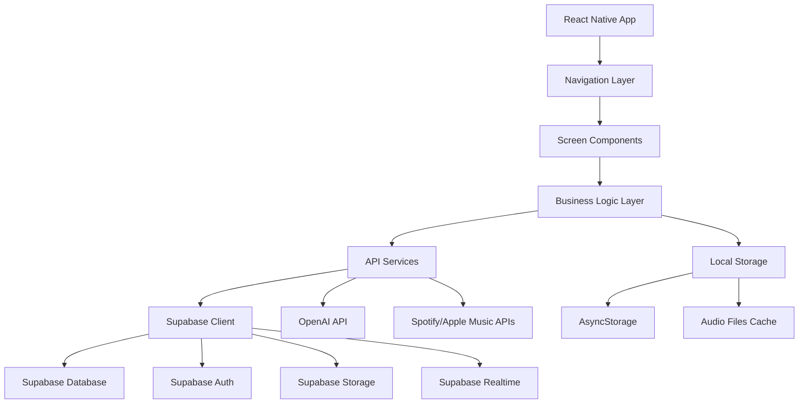

# Design Document

## Overview

CommuteIQ will be built as a React Native mobile application that transforms daily commute time into productive learning experiences. The app leverages OpenAI's API to generate personalized, bite-sized educational content tailored to users' commute duration and learning preferences. The existing React web prototype provides a solid foundation for the mobile UI/UX patterns and user flow.

## Architecture

### High-Level Architecture



### Technology Stack

- **Frontend**: React Native with TypeScript
- **Navigation**: React Navigation 6
- **State Management**: React Context + useReducer
- **Backend Database**: Supabase (PostgreSQL)
- **Authentication**: Supabase Auth
- **Real-time Updates**: Supabase Realtime
- **Local Storage**: AsyncStorage for offline caching
- **Audio Playback**: react-native-track-player
- **API Integration**: Supabase client + Axios for external APIs
- **AI Content Generation**: OpenAI API (GPT-4)
- **Audio Synthesis**: OpenAI TTS API
- **External Integrations**: Spotify SDK, Apple Music API
- **File Storage**: Supabase Storage for audio files
- **Offline Storage**: react-native-fs for cached content
- **UI Components**: React Native Elements + custom components

### Platform Considerations

- **iOS**: Native audio session management, background audio playback
- **Android**: Foreground service for audio playback, notification controls
- **Cross-platform**: Shared business logic, platform-specific audio handling

## Components and Interfaces

### Core Screen Components

#### 1. OnboardingScreen
- **Purpose**: Collect user commute duration and preferences
- **Key Features**: 
  - Slider for commute time selection (5-120 minutes)
  - Welcome messaging and app introduction
  - Smooth transition to subject selection
- **Navigation**: Routes to SubjectSelectionScreen

#### 2. SubjectSelectionScreen
- **Purpose**: Allow users to choose learning subjects
- **Key Features**:
  - Grid layout of subject cards with icons
  - Multi-select functionality
  - Subject categories: Languages, Chess, History, Music Theory, Programming, Literature
  - Dynamic course generation preview
- **Navigation**: Routes to DashboardScreen

#### 3. DashboardScreen
- **Purpose**: Main hub showing learning progress and available courses
- **Key Features**:
  - Progress overview with statistics
  - Course cards with play functionality
  - Premium content promotion
  - Quick access to settings and profile
- **Navigation**: Routes to LessonScreen, SettingsScreen

#### 4. LessonScreen
- **Purpose**: Audio lesson playback with interactive elements
- **Key Features**:
  - Audio player controls (play, pause, skip, rewind)
  - Lesson transcript display
  - Progress tracking
  - Quiz/interaction prompts
  - Background audio support
- **Navigation**: Returns to DashboardScreen

#### 5. SettingsScreen
- **Purpose**: User preferences and account management
- **Key Features**:
  - Commute time adjustment
  - Subject preferences modification
  - Audio quality settings
  - Subscription management
  - External app integrations

### Shared Components

#### AudioPlayer
- **Purpose**: Centralized audio playback management
- **Features**: Play/pause, seek, speed control, background playback
- **Integration**: Works with react-native-track-player

#### ProgressBar
- **Purpose**: Visual progress indication
- **Features**: Animated progress updates, customizable styling

#### CourseCard
- **Purpose**: Display course information and actions
- **Features**: Progress indication, premium badges, play buttons

#### PremiumModal
- **Purpose**: Subscription upgrade interface
- **Features**: Pricing display, feature comparison, purchase flow

## Data Models

### Supabase Database Schema

#### Users Table (extends Supabase Auth)
```sql
CREATE TABLE user_profiles (
  id UUID REFERENCES auth.users(id) PRIMARY KEY,
  commute_time INTEGER NOT NULL DEFAULT 30,
  subscription_tier TEXT NOT NULL DEFAULT 'free' CHECK (subscription_tier IN ('free', 'premium')),
  created_at TIMESTAMP WITH TIME ZONE DEFAULT NOW(),
  last_active_at TIMESTAMP WITH TIME ZONE DEFAULT NOW(),
  preferences JSONB DEFAULT '{}'::jsonb
);
```

### TypeScript Interfaces
```typescript
interface UserProfile {
  id: string;
  commute_time: number; // minutes
  subscription_tier: 'free' | 'premium';
  created_at: string;
  last_active_at: string;
  preferences: UserPreferences;
}

interface UserPreferences {
  audioSpeed: number; // 0.5x to 2.0x
  autoPlay: boolean;
  downloadQuality: 'standard' | 'high';
  notificationsEnabled: boolean;
  backgroundPlayback: boolean;
}
```

#### Subjects Table
```sql
CREATE TABLE subjects (
  id UUID DEFAULT gen_random_uuid() PRIMARY KEY,
  name TEXT NOT NULL,
  icon TEXT NOT NULL,
  color TEXT NOT NULL,
  category TEXT NOT NULL,
  is_premium BOOLEAN DEFAULT FALSE,
  created_at TIMESTAMP WITH TIME ZONE DEFAULT NOW()
);
```

#### Courses Table
```sql
CREATE TABLE courses (
  id UUID DEFAULT gen_random_uuid() PRIMARY KEY,
  title TEXT NOT NULL,
  subject_id UUID REFERENCES subjects(id),
  user_id UUID REFERENCES auth.users(id),
  total_lessons INTEGER DEFAULT 0,
  estimated_duration INTEGER, -- total minutes
  difficulty TEXT CHECK (difficulty IN ('beginner', 'intermediate', 'advanced')),
  is_premium BOOLEAN DEFAULT FALSE,
  created_at TIMESTAMP WITH TIME ZONE DEFAULT NOW()
);
```

#### Lessons Table
```sql
CREATE TABLE lessons (
  id UUID DEFAULT gen_random_uuid() PRIMARY KEY,
  course_id UUID REFERENCES courses(id),
  title TEXT NOT NULL,
  content TEXT NOT NULL,
  audio_url TEXT,
  duration INTEGER, -- minutes
  transcript TEXT,
  lesson_order INTEGER NOT NULL,
  created_at TIMESTAMP WITH TIME ZONE DEFAULT NOW()
);
```

#### User Subject Selections Table
```sql
CREATE TABLE user_subjects (
  id UUID DEFAULT gen_random_uuid() PRIMARY KEY,
  user_id UUID REFERENCES auth.users(id),
  subject_id UUID REFERENCES subjects(id),
  priority INTEGER DEFAULT 1,
  created_at TIMESTAMP WITH TIME ZONE DEFAULT NOW(),
  UNIQUE(user_id, subject_id)
);
```

### TypeScript Interfaces
```typescript
interface Subject {
  id: string;
  name: string;
  icon: string;
  color: string;
  category: string;
  is_premium: boolean;
  created_at: string;
}

interface Course {
  id: string;
  title: string;
  subject_id: string;
  user_id: string;
  total_lessons: number;
  estimated_duration: number; // total minutes
  difficulty: 'beginner' | 'intermediate' | 'advanced';
  is_premium: boolean;
  created_at: string;
  subject?: Subject; // joined data
  lessons?: Lesson[]; // joined data
}

interface Lesson {
  id: string;
  course_id: string;
  title: string;
  content: string; // AI-generated content
  audio_url?: string; // Supabase Storage URL
  duration: number; // minutes
  transcript: string;
  lesson_order: number;
  created_at: string;
}

interface UserSubject {
  id: string;
  user_id: string;
  subject_id: string;
  priority: number;
  created_at: string;
  subject?: Subject; // joined data
}
```

#### Progress Tracking Tables
```sql
CREATE TABLE user_progress (
  id UUID DEFAULT gen_random_uuid() PRIMARY KEY,
  user_id UUID REFERENCES auth.users(id),
  course_id UUID REFERENCES courses(id),
  lesson_id UUID REFERENCES lessons(id),
  progress_percentage DECIMAL(5,2) DEFAULT 0,
  time_spent INTEGER DEFAULT 0, -- seconds
  last_position INTEGER DEFAULT 0, -- audio position in seconds
  completed_at TIMESTAMP WITH TIME ZONE,
  created_at TIMESTAMP WITH TIME ZONE DEFAULT NOW(),
  updated_at TIMESTAMP WITH TIME ZONE DEFAULT NOW(),
  UNIQUE(user_id, lesson_id)
);

CREATE TABLE lesson_interactions (
  id UUID DEFAULT gen_random_uuid() PRIMARY KEY,
  lesson_id UUID REFERENCES lessons(id),
  type TEXT NOT NULL CHECK (type IN ('quiz', 'reflection', 'practice')),
  prompt TEXT NOT NULL,
  options JSONB,
  correct_answer TEXT,
  interaction_order INTEGER NOT NULL,
  created_at TIMESTAMP WITH TIME ZONE DEFAULT NOW()
);

CREATE TABLE user_interaction_responses (
  id UUID DEFAULT gen_random_uuid() PRIMARY KEY,
  user_id UUID REFERENCES auth.users(id),
  interaction_id UUID REFERENCES lesson_interactions(id),
  user_response TEXT NOT NULL,
  is_correct BOOLEAN,
  completed_at TIMESTAMP WITH TIME ZONE DEFAULT NOW(),
  UNIQUE(user_id, interaction_id)
);
```

### TypeScript Interfaces
```typescript
interface UserProgress {
  id: string;
  user_id: string;
  course_id: string;
  lesson_id: string;
  progress_percentage: number;
  time_spent: number; // seconds
  last_position: number; // audio position in seconds
  completed_at?: string;
  created_at: string;
  updated_at: string;
}

interface LessonInteraction {
  id: string;
  lesson_id: string;
  type: 'quiz' | 'reflection' | 'practice';
  prompt: string;
  options?: string[];
  correct_answer?: string;
  interaction_order: number;
  created_at: string;
}

interface UserInteractionResponse {
  id: string;
  user_id: string;
  interaction_id: string;
  user_response: string;
  is_correct?: boolean;
  completed_at: string;
}
```

## API Integration

### Supabase Integration

#### Database Service
```typescript
class SupabaseService {
  private supabase: SupabaseClient;
  
  constructor() {
    this.supabase = createClient(SUPABASE_URL, SUPABASE_ANON_KEY);
  }
  
  // User Management
  async signUp(email: string, password: string): Promise<AuthResponse> {
    return await this.supabase.auth.signUp({ email, password });
  }
  
  async signIn(email: string, password: string): Promise<AuthResponse> {
    return await this.supabase.auth.signInWithPassword({ email, password });
  }
  
  async getCurrentUser(): Promise<User | null> {
    const { data: { user } } = await this.supabase.auth.getUser();
    return user;
  }
  
  // Profile Management
  async createUserProfile(userId: string, profile: Partial<UserProfile>): Promise<UserProfile> {
    const { data, error } = await this.supabase
      .from('user_profiles')
      .insert({ id: userId, ...profile })
      .select()
      .single();
    
    if (error) throw error;
    return data;
  }
  
  async updateUserProfile(userId: string, updates: Partial<UserProfile>): Promise<UserProfile> {
    const { data, error } = await this.supabase
      .from('user_profiles')
      .update(updates)
      .eq('id', userId)
      .select()
      .single();
    
    if (error) throw error;
    return data;
  }
  
  // Course Management
  async createCourse(course: Omit<Course, 'id' | 'created_at'>): Promise<Course> {
    const { data, error } = await this.supabase
      .from('courses')
      .insert(course)
      .select()
      .single();
    
    if (error) throw error;
    return data;
  }
  
  async getUserCourses(userId: string): Promise<Course[]> {
    const { data, error } = await this.supabase
      .from('courses')
      .select(`
        *,
        subject:subjects(*),
        lessons(*)
      `)
      .eq('user_id', userId);
    
    if (error) throw error;
    return data;
  }
  
  // Progress Tracking
  async updateProgress(progress: Omit<UserProgress, 'id' | 'created_at' | 'updated_at'>): Promise<UserProgress> {
    const { data, error } = await this.supabase
      .from('user_progress')
      .upsert(progress)
      .select()
      .single();
    
    if (error) throw error;
    return data;
  }
  
  // Real-time Subscriptions
  subscribeToUserProgress(userId: string, callback: (payload: any) => void) {
    return this.supabase
      .channel('user_progress')
      .on('postgres_changes', {
        event: '*',
        schema: 'public',
        table: 'user_progress',
        filter: `user_id=eq.${userId}`
      }, callback)
      .subscribe();
  }
}
```

### OpenAI API Integration

#### Content Generation Service
```typescript
class ContentGenerationService {
  private supabaseService: SupabaseService;
  
  constructor(supabaseService: SupabaseService) {
    this.supabaseService = supabaseService;
  }
  
  async generateCourse(subject: Subject, commuteTime: number, userId: string): Promise<Course> {
    // Use GPT-4 to generate structured course content
    const courseContent = await this.generateCourseStructure(subject, commuteTime);
    
    // Save course to Supabase
    const course = await this.supabaseService.createCourse({
      title: courseContent.title,
      subject_id: subject.id,
      user_id: userId,
      total_lessons: courseContent.lessons.length,
      estimated_duration: courseContent.estimatedDuration,
      difficulty: courseContent.difficulty,
      is_premium: subject.is_premium
    });
    
    // Generate and save lessons
    for (const lessonData of courseContent.lessons) {
      await this.generateAndSaveLesson(course.id, lessonData);
    }
    
    return course;
  }
  
  async generateAndSaveLesson(courseId: string, lessonData: any): Promise<Lesson> {
    // Generate lesson content optimized for audio consumption
    const content = await this.generateLessonContent(lessonData);
    
    // Generate audio using OpenAI TTS
    const audioBuffer = await this.generateAudio(content.transcript);
    
    // Upload audio to Supabase Storage
    const audioUrl = await this.uploadAudioToStorage(audioBuffer, `${courseId}/${lessonData.id}.mp3`);
    
    // Save lesson to database
    const { data, error } = await this.supabaseService.supabase
      .from('lessons')
      .insert({
        course_id: courseId,
        title: content.title,
        content: content.content,
        audio_url: audioUrl,
        duration: content.duration,
        transcript: content.transcript,
        lesson_order: lessonData.order
      })
      .select()
      .single();
    
    if (error) throw error;
    return data;
  }
  
  async generateAudio(text: string, voice: string = 'alloy'): Promise<Buffer> {
    // Use OpenAI TTS API to convert text to speech
    const response = await fetch('https://api.openai.com/v1/audio/speech', {
      method: 'POST',
      headers: {
        'Authorization': `Bearer ${OPENAI_API_KEY}`,
        'Content-Type': 'application/json',
      },
      body: JSON.stringify({
        model: 'tts-1',
        input: text,
        voice: voice,
      }),
    });
    
    return Buffer.from(await response.arrayBuffer());
  }
  
  async uploadAudioToStorage(audioBuffer: Buffer, path: string): Promise<string> {
    const { data, error } = await this.supabaseService.supabase.storage
      .from('lesson-audio')
      .upload(path, audioBuffer, {
        contentType: 'audio/mpeg',
        upsert: true
      });
    
    if (error) throw error;
    
    const { data: { publicUrl } } = this.supabaseService.supabase.storage
      .from('lesson-audio')
      .getPublicUrl(path);
    
    return publicUrl;
  }
}
```

#### Prompt Engineering Strategy
- **Course Generation**: Structured prompts that specify learning objectives, duration constraints, and difficulty progression
- **Lesson Content**: Audio-optimized content with clear narration, examples, and engagement hooks
- **Interactive Elements**: Context-aware questions and practice exercises
- **Personalization**: User progress and preferences inform content adaptation

### External API Integrations

#### Spotify Integration
```typescript
class SpotifyIntegrationService {
  async createPlaylist(userId: string, lessons: Lesson[]): Promise<string> {
    // Create Spotify playlist with lesson audio files
  }
  
  async syncProgress(playlistId: string, progress: UserProgress[]): Promise<void> {
    // Sync lesson completion status with Spotify
  }
}
```

#### Apple Music Integration
```typescript
class AppleMusicIntegrationService {
  async addToLibrary(lessons: Lesson[]): Promise<void> {
    // Add lesson audio to user's Apple Music library
  }
}
```

## Offline Functionality

### Content Caching Strategy
- **Lesson Audio**: Pre-download next 3-5 lessons based on user progress
- **Course Data**: Cache course structure and lesson metadata locally
- **User Progress**: Queue progress updates for sync when online using AsyncStorage
- **Smart Caching**: Prioritize content based on user patterns and commute schedule
- **Supabase Offline**: Use Supabase's offline-first capabilities with local caching

### Sync Management
```typescript
class OfflineSyncService {
  private supabaseService: SupabaseService;
  
  constructor(supabaseService: SupabaseService) {
    this.supabaseService = supabaseService;
  }
  
  async downloadLessonsForOffline(courseId: string, count: number): Promise<void> {
    // Get lessons from Supabase
    const { data: lessons } = await this.supabaseService.supabase
      .from('lessons')
      .select('*')
      .eq('course_id', courseId)
      .order('lesson_order')
      .limit(count);
    
    // Download audio files and cache locally
    for (const lesson of lessons || []) {
      if (lesson.audio_url) {
        await this.downloadAndCacheAudio(lesson.audio_url, lesson.id);
      }
    }
    
    // Store lesson data in AsyncStorage
    await AsyncStorage.setItem(`offline_lessons_${courseId}`, JSON.stringify(lessons));
  }
  
  async downloadAndCacheAudio(audioUrl: string, lessonId: string): Promise<string> {
    const localPath = `${RNFS.DocumentDirectoryPath}/audio/${lessonId}.mp3`;
    
    // Download file
    await RNFS.downloadFile({
      fromUrl: audioUrl,
      toFile: localPath,
    }).promise;
    
    return localPath;
  }
  
  async syncProgressWhenOnline(): Promise<void> {
    // Get queued progress updates from AsyncStorage
    const queuedUpdates = await AsyncStorage.getItem('queued_progress_updates');
    
    if (queuedUpdates) {
      const updates = JSON.parse(queuedUpdates);
      
      // Sync each update to Supabase
      for (const update of updates) {
        try {
          await this.supabaseService.updateProgress(update);
        } catch (error) {
          console.error('Failed to sync progress:', error);
        }
      }
      
      // Clear queue after successful sync
      await AsyncStorage.removeItem('queued_progress_updates');
    }
  }
  
  async queueProgressUpdate(progress: UserProgress): Promise<void> {
    // Add progress update to queue for later sync
    const existingQueue = await AsyncStorage.getItem('queued_progress_updates');
    const queue = existingQueue ? JSON.parse(existingQueue) : [];
    
    queue.push(progress);
    await AsyncStorage.setItem('queued_progress_updates', JSON.stringify(queue));
  }
  
  async manageStorageSpace(): Promise<void> {
    // Clean up old cached content to manage device storage
    const audioDir = `${RNFS.DocumentDirectoryPath}/audio`;
    const files = await RNFS.readDir(audioDir);
    
    // Remove files older than 30 days
    const thirtyDaysAgo = Date.now() - (30 * 24 * 60 * 60 * 1000);
    
    for (const file of files) {
      if (file.mtime && new Date(file.mtime).getTime() < thirtyDaysAgo) {
        await RNFS.unlink(file.path);
      }
    }
  }
}
```

## Audio System Architecture

### Audio Playback Management
- **Background Playback**: Continue audio during app backgrounding
- **Lock Screen Controls**: Media controls on lock screen
- **Notification Controls**: Playback controls in notification panel
- **Auto-pause**: Pause when headphones disconnected
- **Speed Control**: Variable playback speed (0.5x to 2.0x)

### Audio Quality Management
- **Adaptive Quality**: Adjust based on network conditions
- **Compression**: Optimize file sizes for mobile storage
- **Streaming vs Download**: Hybrid approach based on user preferences

## Error Handling

### Network Error Handling
- **Offline Mode**: Graceful degradation to cached content
- **Retry Logic**: Exponential backoff for API failures
- **User Feedback**: Clear messaging about connectivity issues

### Content Generation Errors
- **Fallback Content**: Pre-generated backup lessons
- **Partial Failures**: Handle incomplete course generation
- **Rate Limiting**: Manage OpenAI API usage limits

### Audio Playback Errors
- **Format Support**: Handle unsupported audio formats
- **Playback Failures**: Retry mechanisms and error reporting
- **Storage Issues**: Manage insufficient device storage

## Testing Strategy

### Unit Testing
- **Business Logic**: Core learning algorithms and progress tracking
- **API Services**: Mock OpenAI and external API responses
- **Data Models**: Validation and transformation logic
- **Utility Functions**: Audio processing and file management

### Integration Testing
- **API Integration**: End-to-end OpenAI content generation
- **Audio Playback**: Cross-platform audio functionality
- **Offline Sync**: Data synchronization scenarios
- **External Integrations**: Spotify and Apple Music connectivity

### User Acceptance Testing
- **Onboarding Flow**: Complete user setup process
- **Learning Experience**: Full lesson completion cycles
- **Offline Usage**: Commute simulation without network
- **Premium Features**: Subscription and premium content access

### Performance Testing
- **Audio Loading**: Lesson startup time optimization
- **Memory Usage**: Efficient audio and content caching
- **Battery Impact**: Background audio power consumption
- **Storage Management**: Content cleanup and optimization

## Security Considerations

### API Key Management
- **Environment Variables**: Secure OpenAI API key storage
- **Key Rotation**: Regular API key updates
- **Usage Monitoring**: Track and limit API consumption

### User Data Protection
- **Local Encryption**: Encrypt sensitive user data
- **Secure Transmission**: HTTPS for all API communications
- **Privacy Compliance**: GDPR and CCPA compliance measures

### Content Security
- **Audio File Integrity**: Verify downloaded content
- **Malicious Content**: Content filtering and validation
- **Premium Content Protection**: DRM considerations for paid content

## Scalability Considerations

### Supabase Scaling Benefits
- **Automatic Scaling**: Supabase handles database scaling automatically
- **Edge Functions**: Use Supabase Edge Functions for serverless content generation
- **Global CDN**: Supabase Storage provides global content delivery
- **Real-time Features**: Built-in real-time subscriptions for live progress updates
- **Cross-Device Sync**: Automatic cloud synchronization across all devices
- **Multi-Platform Support**: Same backend for mobile, web, and future platforms

### Content Generation Scaling
- **Edge Functions**: Move OpenAI API calls to Supabase Edge Functions
- **Batch Processing**: Generate multiple lessons efficiently using database transactions
- **Content Caching**: Cache generated content in Supabase for reuse across users
- **Rate Limiting**: Implement user-based rate limiting for AI content generation

### User Growth Planning
- **Database Optimization**: Leverage PostgreSQL indexing and query optimization
- **Row Level Security**: Use Supabase RLS for secure multi-tenant data access
- **Analytics Integration**: Built-in Supabase analytics and custom event tracking
- **Backup and Recovery**: Automated backups and point-in-time recovery

### Supabase Edge Functions Example
```typescript
// supabase/functions/generate-course/index.ts
import { serve } from 'https://deno.land/std@0.168.0/http/server.ts'
import { createClient } from 'https://esm.sh/@supabase/supabase-js@2'

serve(async (req) => {
  const { subject_id, user_id, commute_time } = await req.json()
  
  // Initialize Supabase client
  const supabase = createClient(
    Deno.env.get('SUPABASE_URL') ?? '',
    Deno.env.get('SUPABASE_SERVICE_ROLE_KEY') ?? ''
  )
  
  // Generate course content using OpenAI
  const courseContent = await generateCourseWithOpenAI(subject_id, commute_time)
  
  // Save to database
  const { data: course } = await supabase
    .from('courses')
    .insert({
      title: courseContent.title,
      subject_id,
      user_id,
      total_lessons: courseContent.lessons.length,
      estimated_duration: courseContent.estimatedDuration,
      difficulty: courseContent.difficulty
    })
    .select()
    .single()
  
  return new Response(JSON.stringify(course), {
    headers: { 'Content-Type': 'application/json' }
  })
})
```

## Cross-Device Synchronization

### Cloud Sync Architecture

#### Device Registration and Management
```sql
CREATE TABLE user_devices (
  id UUID DEFAULT gen_random_uuid() PRIMARY KEY,
  user_id UUID REFERENCES auth.users(id),
  device_id TEXT NOT NULL, -- unique device identifier
  device_name TEXT NOT NULL, -- user-friendly name
  device_type TEXT NOT NULL CHECK (device_type IN ('mobile', 'web', 'tablet')),
  platform TEXT NOT NULL, -- 'ios', 'android', 'web'
  last_active_at TIMESTAMP WITH TIME ZONE DEFAULT NOW(),
  push_token TEXT, -- for notifications
  created_at TIMESTAMP WITH TIME ZONE DEFAULT NOW(),
  UNIQUE(user_id, device_id)
);
```

#### Sync State Management
```sql
CREATE TABLE sync_state (
  id UUID DEFAULT gen_random_uuid() PRIMARY KEY,
  user_id UUID REFERENCES auth.users(id),
  device_id TEXT NOT NULL,
  last_sync_at TIMESTAMP WITH TIME ZONE DEFAULT NOW(),
  sync_version INTEGER DEFAULT 1,
  pending_changes JSONB DEFAULT '[]'::jsonb,
  created_at TIMESTAMP WITH TIME ZONE DEFAULT NOW(),
  updated_at TIMESTAMP WITH TIME ZONE DEFAULT NOW(),
  UNIQUE(user_id, device_id)
);
```

### Cross-Device Sync Service
```typescript
class CrossDeviceSyncService {
  private supabaseService: SupabaseService;
  private deviceId: string;
  
  constructor(supabaseService: SupabaseService) {
    this.supabaseService = supabaseService;
    this.deviceId = this.generateDeviceId();
  }
  
  async registerDevice(userId: string, deviceInfo: DeviceInfo): Promise<void> {
    await this.supabaseService.supabase
      .from('user_devices')
      .upsert({
        user_id: userId,
        device_id: this.deviceId,
        device_name: deviceInfo.name,
        device_type: deviceInfo.type,
        platform: deviceInfo.platform,
        push_token: deviceInfo.pushToken,
        last_active_at: new Date().toISOString()
      });
  }
  
  async syncUserData(userId: string): Promise<SyncResult> {
    // Get latest sync state
    const { data: syncState } = await this.supabaseService.supabase
      .from('sync_state')
      .select('*')
      .eq('user_id', userId)
      .eq('device_id', this.deviceId)
      .single();
    
    const lastSyncTime = syncState?.last_sync_at || '1970-01-01T00:00:00Z';
    
    // Fetch all data updated since last sync
    const syncData = await this.fetchUpdatedData(userId, lastSyncTime);
    
    // Update local data
    await this.updateLocalData(syncData);
    
    // Update sync state
    await this.updateSyncState(userId, syncData.version);
    
    return {
      success: true,
      updatedCourses: syncData.courses.length,
      updatedProgress: syncData.progress.length,
      lastSyncTime: new Date().toISOString()
    };
  }
  
  async fetchUpdatedData(userId: string, since: string): Promise<SyncData> {
    // Fetch courses updated since last sync
    const { data: courses } = await this.supabaseService.supabase
      .from('courses')
      .select(`
        *,
        subject:subjects(*),
        lessons(*)
      `)
      .eq('user_id', userId)
      .gte('updated_at', since);
    
    // Fetch progress updated since last sync
    const { data: progress } = await this.supabaseService.supabase
      .from('user_progress')
      .select('*')
      .eq('user_id', userId)
      .gte('updated_at', since);
    
    // Fetch user profile updates
    const { data: profile } = await this.supabaseService.supabase
      .from('user_profiles')
      .select('*')
      .eq('id', userId)
      .gte('updated_at', since)
      .single();
    
    return {
      courses: courses || [],
      progress: progress || [],
      profile,
      version: Date.now()
    };
  }
  
  async handleConflictResolution(localData: any, remoteData: any): Promise<any> {
    // Implement conflict resolution strategy
    // For progress: use latest timestamp
    // For preferences: merge with remote taking precedence
    // For courses: remote always wins (server-generated content)
    
    if (localData.updated_at > remoteData.updated_at) {
      // Local is newer, push to server
      await this.pushLocalChanges(localData);
      return localData;
    } else {
      // Remote is newer, use remote data
      return remoteData;
    }
  }
  
  async enableRealtimeSync(userId: string): Promise<void> {
    // Subscribe to real-time changes for user data
    this.supabaseService.supabase
      .channel(`user_sync_${userId}`)
      .on('postgres_changes', {
        event: '*',
        schema: 'public',
        table: 'user_progress',
        filter: `user_id=eq.${userId}`
      }, (payload) => {
        this.handleRealtimeUpdate('progress', payload);
      })
      .on('postgres_changes', {
        event: '*',
        schema: 'public',
        table: 'courses',
        filter: `user_id=eq.${userId}`
      }, (payload) => {
        this.handleRealtimeUpdate('courses', payload);
      })
      .subscribe();
  }
  
  private async handleRealtimeUpdate(type: string, payload: any): Promise<void> {
    // Update local cache with real-time changes
    // Notify UI components of updates
    // Handle potential conflicts with local changes
    
    switch (payload.eventType) {
      case 'INSERT':
      case 'UPDATE':
        await this.updateLocalCache(type, payload.new);
        break;
      case 'DELETE':
        await this.removeFromLocalCache(type, payload.old.id);
        break;
    }
    
    // Emit event for UI updates
    this.emitSyncEvent(type, payload);
  }
}
```

### Multi-Platform Support

#### Web Application Sync
```typescript
// Web version using same Supabase backend
class WebSyncService extends CrossDeviceSyncService {
  constructor() {
    super(new SupabaseService());
    this.deviceId = this.generateWebDeviceId();
  }
  
  async syncWithMobile(): Promise<void> {
    // Sync data between web and mobile versions
    // Handle web-specific features like larger screen layouts
    // Maintain same user experience across platforms
  }
}
```

#### Device Migration Support
```typescript
class DeviceMigrationService {
  async migrateToNewDevice(oldDeviceId: string, newDeviceId: string, userId: string): Promise<void> {
    // Transfer offline content to new device
    // Update device registration
    // Sync all user data to new device
    
    // Mark old device as inactive
    await this.supabaseService.supabase
      .from('user_devices')
      .update({ last_active_at: new Date().toISOString() })
      .eq('device_id', oldDeviceId)
      .eq('user_id', userId);
    
    // Register new device
    await this.registerDevice(userId, newDeviceInfo);
    
    // Full sync to new device
    await this.syncUserData(userId);
  }
  
  async exportUserData(userId: string): Promise<UserDataExport> {
    // Export all user data for backup/migration
    // Include courses, progress, preferences, and cached content
    return {
      profile: await this.getUserProfile(userId),
      courses: await this.getUserCourses(userId),
      progress: await this.getUserProgress(userId),
      preferences: await this.getUserPreferences(userId),
      exportDate: new Date().toISOString()
    };
  }
}
```

### Offline-First with Cloud Sync

#### Smart Sync Strategy
- **Immediate Sync**: Critical data (progress, preferences) syncs immediately when online
- **Background Sync**: Course content and non-critical data syncs in background
- **Conflict Resolution**: Last-write-wins for progress, server-wins for generated content
- **Bandwidth Optimization**: Delta sync only sends changed data
- **Storage Management**: Automatic cleanup of old cached content across devices

#### Sync Status Indicators
```typescript
interface SyncStatus {
  isOnline: boolean;
  lastSyncTime: string;
  pendingChanges: number;
  syncInProgress: boolean;
  conflictsDetected: boolean;
}

class SyncStatusService {
  async getSyncStatus(userId: string): Promise<SyncStatus> {
    // Return current sync status for UI display
  }
  
  async forceSyncNow(userId: string): Promise<void> {
    // Manual sync trigger for user-initiated sync
  }
}
```

### Cross-Device Features

#### Seamless Handoff
- **Continue on Another Device**: Resume lessons exactly where left off
- **Cross-Device Notifications**: Notify other devices of progress updates
- **Shared Playlists**: Spotify/Apple Music playlists sync across devices
- **Universal Settings**: Preferences apply across all devices

#### Multi-Device Analytics
```sql
CREATE TABLE user_activity_log (
  id UUID DEFAULT gen_random_uuid() PRIMARY KEY,
  user_id UUID REFERENCES auth.users(id),
  device_id TEXT NOT NULL,
  activity_type TEXT NOT NULL,
  activity_data JSONB,
  created_at TIMESTAMP WITH TIME ZONE DEFAULT NOW()
);
```

This comprehensive cloud sync architecture ensures users can seamlessly switch between devices, access their learning progress anywhere, and never lose their educational journey regardless of device changes or platform preferences.