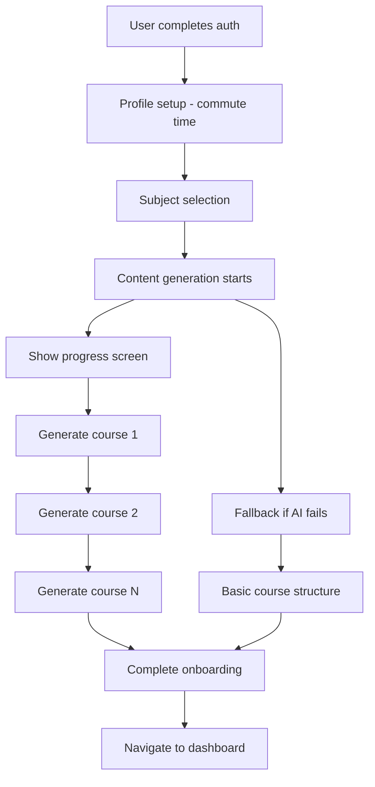

# Content Generation Triggers in CommutIQ

This document outlines when and how content generation is triggered throughout the app lifecycle.

## 🚀 Primary Trigger Points

### 1. **Onboarding Completion** (Main Trigger)
**When**: After user completes subject selection during initial onboarding
**Where**: `components/OnboardingFlow.tsx` → `handleSubjectsComplete()`
**What happens**:
- User selects subjects they want to learn
- App shows "Creating Your Learning Experience" screen
- Generates courses for each selected subject sequentially
- Shows progress indicator with current subject being generated
- Falls back to basic course structure if AI generation fails
- Completes onboarding and navigates to dashboard

**Code Flow**:
```typescript
// OnboardingFlow.tsx
const handleSubjectsComplete = async (selectedSubjects: Subject[]) => {
  setCurrentStep('generating');
  
  for (const subject of selectedSubjects) {
    try {
      await contentGenerationService.generateCourse({
        subject_id: subject.id,
        user_id: userId,
        commute_time: commuteTime,
        difficulty: 'beginner',
      });
    } catch (error) {
      // Fallback generation
      await contentGenerationService.generateFallbackCourse(subject, commuteTime, userId);
    }
  }
  
  onComplete(userId, selectedSubjects);
};
```

### 2. **Background Generation** (Secondary)
**When**: After onboarding, for additional subjects or updated preferences
**Where**: `services/backgroundContentGeneration.ts`
**What happens**:
- Queues content generation tasks
- Processes queue in background without blocking UI
- Handles priority-based generation
- Manages API rate limiting with delays

### 3. **Settings Updates** (Conditional)
**When**: User significantly changes commute time or difficulty preferences
**Where**: Settings screen (when implemented)
**What happens**:
- Checks if changes warrant regeneration (>10 min commute time change)
- Queues regeneration of existing courses with new parameters
- Processes in background

### 4. **New Subject Addition** (On-demand)
**When**: User adds new subjects to their learning plan
**Where**: Subject management screen (when implemented)
**What happens**:
- Immediately generates courses for newly selected subjects
- Uses current user preferences (commute time, difficulty)

## 📱 User Experience Flow



## ⚙️ Technical Implementation

### Content Generation Service
- **Location**: `services/contentGenerationService.ts`
- **Main method**: `generateCourse()`
- **Fallback method**: `generateFallbackCourse()`
- **Audio generation**: `generateAudio()` using OpenAI TTS

### Background Processing
- **Location**: `services/backgroundContentGeneration.ts`
- **Queue management**: Priority-based processing
- **Rate limiting**: 2-second delays between generations
- **Error handling**: Automatic fallback attempts

## 🎯 Generation Parameters

### Course Generation Request
```typescript
interface CourseGenerationRequest {
  subject_id: string;      // Selected subject
  user_id: string;         // Current user
  commute_time: number;    // From onboarding (5-240 minutes)
  difficulty?: string;     // 'beginner' | 'intermediate' | 'advanced'
}
```

### Generated Content Structure
- **Course**: Title, difficulty, estimated duration, lesson count
- **Lessons**: 8-12 lessons per course, each fitting commute time
- **Audio**: MP3 files generated via OpenAI TTS
- **Interactions**: Quiz, reflection, and practice elements

## 🔄 Retry and Fallback Logic

### Primary Generation Failure
1. **OpenAI API Error**: Retry once, then fallback
2. **Network Error**: Queue for background retry
3. **Validation Error**: Use fallback content structure

### Fallback Content
- Pre-defined lesson templates
- Basic course structure without AI generation
- No audio files (text-only initially)
- Can be enhanced later via background generation

## 📊 Performance Considerations

### Generation Time
- **Per Course**: ~30-60 seconds (including audio generation)
- **Multiple Subjects**: Sequential processing with progress updates
- **Background Queue**: Processes without blocking UI

### API Usage
- **GPT-4**: ~1,500 tokens per lesson (content generation)
- **TTS**: ~2,000 characters per lesson (audio generation)
- **Rate Limiting**: Built-in delays to respect API limits

### Storage
- **Audio Files**: Uploaded to Supabase Storage
- **Course Data**: Stored in PostgreSQL database
- **Caching**: Local caching for offline access

## 🚨 Error Scenarios

### Complete Generation Failure
- Shows error message with option to continue
- User can access app with fallback content
- Background service continues attempting generation

### Partial Generation Failure
- Successfully generated courses are available
- Failed subjects show basic content
- Background retry for failed subjects

### Network Issues
- Queues generation for when online
- Shows appropriate offline messaging
- Syncs when connection restored

## 🔧 Configuration

### Environment Variables Required
```env
EXPO_PUBLIC_OPENAI_API_KEY=your-openai-key
EXPO_PUBLIC_SUPABASE_URL=your-supabase-url
EXPO_PUBLIC_SUPABASE_ANON_KEY=your-supabase-key
```

### OpenAI Configuration
- **Model**: GPT-4 for content, TTS-1 for audio
- **Voice**: 'alloy' (default), configurable per user
- **Quality**: Standard audio quality for mobile optimization

## 📈 Future Enhancements

### Planned Triggers
1. **Periodic Refresh**: Weekly new lesson generation
2. **Progress-Based**: Advanced courses when user completes beginner
3. **Seasonal Content**: Holiday or event-based special courses
4. **Social Features**: Courses based on friend recommendations

### Optimization Opportunities
1. **Batch Generation**: Multiple lessons per API call
2. **Template Caching**: Reuse successful course structures
3. **Predictive Generation**: Pre-generate popular combinations
4. **Edge Computing**: Move generation closer to users

## 🎯 Success Metrics

### Generation Success Rate
- Target: >95% successful course generation
- Fallback usage: <5% of total generations
- User satisfaction: Measured via course completion rates

### Performance Targets
- Onboarding completion: <2 minutes including generation
- Background generation: No impact on app responsiveness
- Error recovery: <10 seconds to fallback content

---

This system ensures users always have learning content available while providing the best possible AI-generated experience when conditions allow.